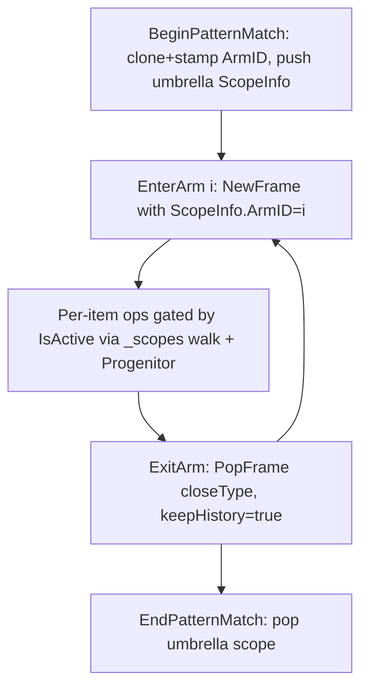

# Overview

### Goal

Implement `?`-style pattern matching by **integrating with existing runtime primitives** (`ScopeInfo`, `NewFrame`/`PopFrame`, `Progenitor` chain) instead of building a parallel scope/depth system on top.

### Guiding principles

- **Highway over physical split.** Keep the linear `_timeline` invariant — debugger scrub, `Pack`/`Unpack`, and `PopFrame` rebasing all depend on it.
- **One scope stack, one mental model.** Arm membership lives on `ScopeInfo`, not in a parallel `_activeArms`.
- **Nesting comes from `Progenitor`, not from a depth counter.** The timeline already encodes nesting; arm membership is determined by walking the progenitor chain to the current arm-scope's start layer.
- **Reuse `PopFrame` for per-arm close types.** `Replace`/`SideEffect`/`ListAppend` already exist; don't re-implement them as bespoke `ExitArm` helpers.

### Outcomes vs. the prior plan

- Drop `MatchDepth` field on `PKItem`.
- Drop `_activeArms` stack.
- Drop four bespoke `Context` methods that mirror `NewFrame`/`PopFrame`.
- Add: one field on `ScopeInfo`, one flag on `PopFrame`, one cloning helper that stamps `ArmID`.

# Current Implementation

### Relevant existing code

- **`Context._timeline`** (`Context.cs:10`) — linear list of `PKLayer`s. Invariant: layers grow forward in time; never split sideways.
- **`Context._scopes : Stack<ScopeInfo>`** (`Context.cs:11`) — open scopes. Each entry knows its `StartLayerIndex`, whether it is an expansion scope, and an optional `Name`.
- **`ScopeInfo`** (`ScopeInfo.cs:4`) — `StartLayerIndex`, `Name`, `IsExpansionScope`.
- **`Context.NewFrame` / `NewNamedFrame` / `NewClonedLayer`** (`Context.cs:~280–310`) — push a scope and clone the top layer.
- **`Context.PopFrame(BranchType)`** (`Context.cs:~320`) — merges body back into start layer, switching on `BranchType.SideEffect | Replace | ListAppend`. Currently `Replace` overwrites `_timeline[startIdx]`, **destroying intermediate layer history**.
- **Per-item ops** `OperateOnEach` / `FilterOnEach` / `SignalOnEach` / `PushStreamWithGenerator` / `PushStreamWithPipeGenerator` — currently take an `int? armID` parameter and `continue` past non-matching items. `FilterOnEach` correctly forwards inactive items (`Context.cs` filter branch).
- **`PKItem.ArmID`** (`PKItem.cs:12`) — already in place.
- **`PKItem.Progenitor`** (`PKItem.cs:8`) and **`Context.ResolveVariable`** (`Context.cs:~200`) — progenitor walk is the existing mechanism for resolving across nested scopes.
- **`Context.SplitLayersByMatch`** stub (`Context.cs:~445`) — placeholder to be replaced. Its inline comment about "breaks historical precedence" is exactly the concern the highway model addresses; preserve that note in the new design comment.

# Key Decisions

### Decisions to validate

1. **Arm scopes are real `ScopeInfo` entries.** Add `int? ArmID` (and likely `bool IsArmUmbrella`) to `ScopeInfo`. Activity gate looks up the innermost arm-bearing scope on `_scopes`.
2. **No `MatchDepth` on `PKItem`.** Nested-arm disambiguation uses progenitor-walk back to the current arm scope's `StartLayerIndex`. Performance is secondary; correctness and code economy win.
3. **Per-arm body close = `PopFrame(closeType, keepHistory: true)`.** Add a `keepHistory` flag to `PopFrame` so `Replace` retains the per-arm intermediate layers (essential for the debugger's per-arm visualization). All other merge logic is reused as-is.
4. **Umbrella scope on `BeginPatternMatch`.** A single cloned layer where the clone stamps `ArmID` on each new `PKItem`; pushes one umbrella `ScopeInfo` with `IsArmUmbrella=true`, `ArmID=null` (no arm bound yet).
5. **`EndPatternMatch` cleanup.** Pop the umbrella scope. Do not eagerly clear `ArmID` on the resulting top layer; the next outer scope's `NewClonedLayer` (or any per-item op producing fresh `PKItem`s) naturally yields items with `ArmID = null` for outer code. (Cheaper, simpler.)
6. **`ListAppend` arms: deferred.** The highway invariant ("every layer same `Items.Count`") only holds for `Replace`/`SideEffect`. Defer `ListAppend` arms until the visualization story is settled.
7. **Filter-arm filters resolve bindings via `CurrentItem`.** The partition pass sets `CurrentItem = p` per parent item, mirroring `FilterOnEach`, so `@threshold` etc. resolve through the existing progenitor walk.

# Proposed Changes

### Data model

- **`ScopeInfo`** (`ScopeInfo.cs`): add
  - `int? ArmID` — set on per-arm body scopes; `null` on non-arm scopes and on the umbrella.
  - `bool IsArmUmbrella` — marks the partition scope that owns the `?`.
- **`PKItem`** (`PKItem.cs`): keep existing `ArmID`. **Do not add `MatchDepth`.**

### Activity gate

Replace `int? armID` parameter on per-item ops with a single ambient predicate inside `Context`:

```csharp
private bool IsActive(PKItem it) {
    foreach (var s in _scopes) {
        if (s.IsArmUmbrella) return true; // inside ? but not inside a specific arm body
        if (s.ArmID != null) {
            // Walk it back to a progenitor that lives in this arm scope's start layer.
            var startLayer = _timeline[s.StartLayerIndex];
            var cur = it;
            while (cur != null) {
                if (startLayer.Items.Contains(cur)) // HashSet in practice
                    return cur.ArmID == s.ArmID;
                cur = cur.Progenitor;
            }
            return false;
        }
    }
    return true; // no arm context — everyone active
}
```

Per-item ops change from `if (armID != null && p.ArmID != armID) continue;` to `if (!IsActive(p)) { /* pass-through for Filter; skip for Operate/Signal/PushStream-with-forward-copy */ }`.

**Important cleanup** (was glossed in prior plan §3.2): `PushStreamWithGenerator` / `PushStreamWithPipeGenerator` currently `continue` past non-matching items. Under the activity gate they must **forward-copy inactive items** into the expanded layer (mirroring `FilterOnEach`'s pass-through), otherwise outer-arm items get dropped during nested `>` inside a `?` body.

### Lifecycle methods

Replace prior plan's four bespoke methods with:

- **`BeginPatternMatch(filters[], hasAlternate)`**
  - `NewClonedLayer()`-style clone where the cloning helper stamps `ArmID` on each new `PKItem` according to the first matching filter (with `CurrentItem` set during evaluation so bindings resolve).
  - Push one `ScopeInfo { StartLayerIndex = preCloneTop, IsArmUmbrella = true, ArmID = null }`.

- **`EnterArm(int i)`**
  - `NewFrame`-style push of `ScopeInfo { StartLayerIndex = currentTop, ArmID = i, IsExpansionScope = false }` + `NewClonedLayer()`.

- **`ExitArm(BranchType closeType)`**
  - `PopFrame(closeType, keepHistory: true)`. No bespoke logic.

- **`EndPatternMatch()`**
  - Pop the umbrella `ScopeInfo`. No layer cleanup; outer ops naturally produce `ArmID = null` items downstream.

### `PopFrame` change

Add `bool keepHistory = false` to `PopFrame`. When `true` in the `Replace` branch, write the merged layer as a **new** top layer (`_timeline.Add(merged)`) instead of `_timeline[startIdx] = merged` + `RemoveRange`. Existing call sites pass `false` and behavior is unchanged.

### Removed / deferred

- Delete `SplitLayersByMatch` stub. Preserve its "historical precedence" comment in the new `BeginPatternMatch` doc-comment as the rationale for the highway model.
- Remove `int? armID` parameter from `OperateOnEach`, `FilterOnEach`, `SignalOnEach`, `PushStreamWithGenerator`, `PushStreamWithPipeGenerator`.
- Defer `ListAppend` arms.

### Architecture diagram



# Testing

### Validation approach

Exercise `Context` directly + end-to-end pipeline tests parallel to existing runtime tests.

### Key scenarios

- Single `?` with two `Replace` arms: each parent item ends in exactly one arm's transformation; non-matched items (if `hasAlternate=false`) pass through unchanged.
- `?` with `SideEffect` arm: top layer values unchanged; named bindings from the arm propagate via the existing `PopFrame.SideEffect` path.
- Nested `?` inside an arm body: inner arm sees only items active in the outer arm; outer-arm items in the inner scope are inactive (verified by progenitor walk, no `MatchDepth` field).
- Filter-arm filters referencing outer variables (`@threshold`) — confirms `CurrentItem` is set during partition.
- Nested `>` (expansion) inside an arm body: inactive parents are forward-copied into the expanded layer, not dropped.
- Debugger / timeline: per-arm intermediate layers are preserved (`keepHistory: true`).

### Edge cases

- Empty parent layer entering `?`.
- Arm with zero matching items (body still executes over zero items; close merges cleanly).
- `ResolveVariable` across arm body → outer scope still resolves via progenitor.

### Invariants to assert

- For `Replace`/`SideEffect` arms only: `Items.Count` is constant across partition → arm body → post-arm layer.
- `_scopes.Count` returns to its pre-`BeginPatternMatch` value after `EndPatternMatch`.
- No item is dropped across a `?` boundary.

# Delivery Steps

###   Step 1: Extend ScopeInfo and add activity gate
`ScopeInfo` carries arm identity and `Context` exposes an ambient `IsActive` predicate.

- Add `int? ArmID` and `bool IsArmUmbrella` fields to `ScopeInfo` (`ScopeInfo.cs`).
- Implement `Context.IsActive(PKItem)` that walks `_scopes` from innermost outward; on the first arm-bearing scope, walks the item's `Progenitor` chain back to that scope's `StartLayerIndex` layer and compares `ArmID`.
- Use a `HashSet<PKItem>` per arm scope (cached on `ScopeInfo` or computed lazily) for the start-layer membership check.
- Add a doc-comment explaining why nesting is resolved via `Progenitor` rather than a depth counter (pull rationale from the existing `SplitLayersByMatch` comment).

###   Step 2: Switch per-item ops from armID parameter to activity gate
All per-item ops use the ambient gate; inactive items are handled correctly per op type.

- Remove the `int? armID = null` parameter from `OperateOnEach`, `FilterOnEach`, `SignalOnEach`, `PushStreamWithGenerator`, `PushStreamWithPipeGenerator` in `Context.cs`.
- `OperateOnEach`: inactive items are forward-copied into the next layer as new `PKItem(p.Value, p)` (preserves count + progenitor link) instead of being skipped. ✅ done.
- `FilterOnEach`: keep existing pass-through behavior, but trigger it via `!IsActive(p)` instead of the `armID` mismatch check. ✅ done.
- `SignalOnEach`: skip inactive items (no layer advance, no count concern). ✅ done.
- `PushStreamWithGenerator` / `PushStreamWithPipeGenerator`: replace `continue` with forward-copy of inactive parents into the expanded layer as childless leaves, preserving the highway invariant when nested `>` runs inside a `?` body. **⏳ remaining — see Step 2a.**
- Update all call sites that pass `armID` (search in `SimpleEvaluator` and related).

###   Step 2a: Forward-copy inactive parents in stream expansions
`PushStreamWithGenerator` (nested branch, `Context.cs:55–68`) and `PushStreamWithPipeGenerator` (`Context.cs:95–110`) emit a single childless leaf per inactive parent instead of skipping it.

- In **both** methods, at the top of the `foreach (var p in parent.Items)` loop, add a guard:
  - If `!IsActive(p)`: create `var leaf = new PKItem(p.Value, p) { Index = 0 };`, add to `expanded.Items`, `continue`. Do not invoke the generator and do not call `ResolveArgs` (so we never trigger a `ResolveVariable` lookup on bindings that aren't visible to an inactive item).
  - Do **not** set `leaf.ArmID`; activity for downstream layers is resolved by the existing progenitor walk back to the arm scope's start layer.
- The root branch of `PushStreamWithGenerator` (`Context.cs:28–41`) needs no change — no arm scope can be above the synthetic root.
- Verify the expansion-scope merge in `PopFrame` (`Context.cs:~345`) collapses the childless leaf identically to a 1-child fan-out (both have `Progenitor = p`); no `PopFrame` code change expected.
- Add a test in `PocketknifeCompiler.Tests` covering nested `>` inside an arm body:
  - Partition 4 items into arms 0 and 1 (2 each) via `BeginPatternMatch`.
  - `EnterArm(0)` with `BranchType.Replace`, then a nested `PushStreamWithGenerator` that fans each item to 3 children.
  - Assert `Top.Items.Count == 2 (inactive leaves) + 2 * 3 (active fan-out) == 8`.
  - `PopFrame` the inner expansion, `ExitArm`, `EndPatternMatch`; assert the final layer has 4 items and inactive items retained their original values.
- Optional symmetry test for `PushStreamWithPipeGenerator` with an outer-scope binding (`@threshold`-style) referenced from the active arm only, to confirm inactive parents never trigger `ResolveArgs`.

###   Step 3: Add keepHistory flag to PopFrame
`PopFrame` can preserve per-arm intermediate layers without changing existing call sites.

- Add `bool keepHistory = false` parameter to `Context.PopFrame`.
- In the `BranchType.Replace` branch, when `keepHistory` is true, append `merged` as a new top layer (`_timeline.Add(merged)`) instead of overwriting `_timeline[startIdx]` and trimming.
- Leave `SideEffect` and `ListAppend` branches unchanged for now (`ListAppend` arms are deferred).
- Verify all existing tests still pass with default `keepHistory = false`.

###   Step 4: Implement BeginPatternMatch and partition stamping
`?` entry produces one cloned layer where each item carries its matched `ArmID`, and pushes one umbrella scope.

- Add `Context.BeginPatternMatch(OpInvoker[] filters, object[][] filterArgs, bool hasAlternate)`.
- Internally: snapshot `_timeline.Count - 1` as `startIdx`; build a new `PKLayer` by iterating parent items, setting `CurrentItem = p` (so bindings resolve via existing `ResolveVariable`), evaluating each filter in order, and creating a new `PKItem(p.Value, p)` with `ArmID` set to the first-matching arm index (or `null` if none matched and `hasAlternate` is false; or to the alternate's index if it exists).
- Push `ScopeInfo { StartLayerIndex = startIdx, IsArmUmbrella = true, ArmID = null }`.
- Append the new layer; clear `CurrentItem`.
- Document the highway-vs-physical-split rationale at the top of the method.

###   Step 5: Implement EnterArm, ExitArm, and EndPatternMatch
Per-arm bodies reuse `NewFrame`/`PopFrame` instead of bespoke exit logic.

- `Context.EnterArm(int armIndex)`: push `ScopeInfo { StartLayerIndex = _timeline.Count - 1, ArmID = armIndex, IsExpansionScope = false, IsArmUmbrella = false }`, then `NewClonedLayer()`.
- `Context.ExitArm(BranchType closeType)`: delegate to `PopFrame(closeType, keepHistory: true)` — no new merge code.
- `Context.EndPatternMatch()`: assert top of `_scopes` is the umbrella; pop it. Do not mutate top layer items — outer ops will naturally produce fresh `PKItem`s with `ArmID = null` downstream.
- Delete the `SplitLayersByMatch` stub; move its caveat comment into `BeginPatternMatch`'s doc.

###   Step 6: Wire the evaluator and validate
`SimpleEvaluator` emits the new lifecycle calls, and the integration is exercised end to end.

- Update `SimpleEvaluator` (or whichever site compiles `?` expressions) to emit `BeginPatternMatch` / `EnterArm(i)` / body ops / `ExitArm(closeType)` / `EndPatternMatch` instead of the old `armID`-threaded calls.
- Remove now-unused `armID` arguments from generated IR / invocation code.
- Add tests covering: single `?` with two `Replace` arms, `?` with `SideEffect` arm + named binding, nested `?`, filter-arm referencing `@outerVar`, nested `>` inside an arm body (verifies forward-copy of inactive parents).
- Assert invariants: `Items.Count` constant across `Replace`/`SideEffect` arm boundaries; `_scopes.Count` returns to pre-`?` value after `EndPatternMatch`; per-arm intermediate layers visible in `_timeline` for debugger.
- Explicitly defer `ListAppend` arms with a TODO referencing the invariant question.